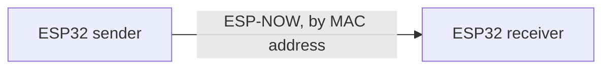
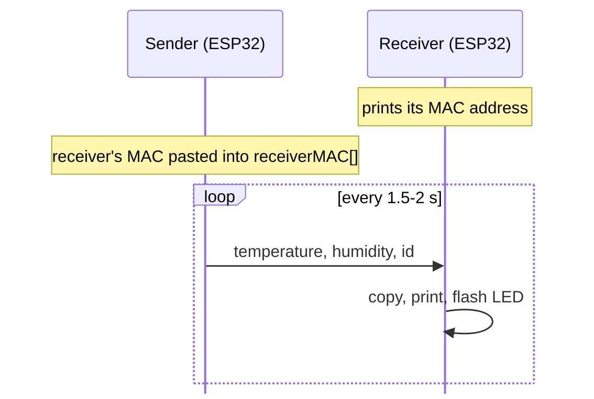

```mermaid
flowchart LR
    S[ESP32 sender] -- "ESP-NOW, by MAC address" --> R[ESP32 receiver]
```

```mermaid
%%{init: {"sequence": {"mirrorActors": false}}}%%
sequenceDiagram
    participant S as Sender (ESP32)
    participant R as Receiver (ESP32)
    Note over R: prints its MAC address
    Note over S: receiver's MAC pasted into receiverMAC[]
    loop every 1.5-2 s
        S->>R: temperature, humidity, id
        R->>R: copy, print, flash LED
    end
```