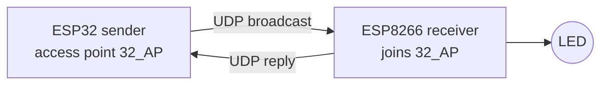
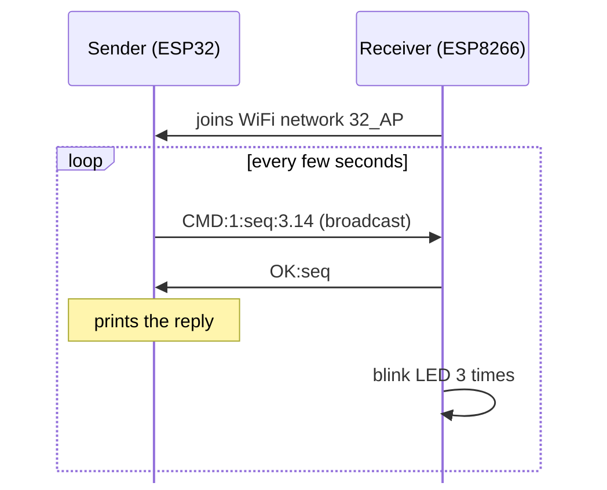

## 03 - ESP32 to ESP8266, LED

```mermaid
flowchart LR
    S["ESP32 sender<br/>access point 32_AP"] -- "UDP broadcast" --> R["ESP8266 receiver<br/>joins 32_AP"]
    R -- "UDP reply" --> S
    R --> L(("LED"))
```

```mermaid
%%{init: {"sequence": {"mirrorActors": false}}}%%
sequenceDiagram
    participant S as Sender (ESP32)
    participant R as Receiver (ESP8266)
    R->>S: joins WiFi network 32_AP
    loop every few seconds
        S->>R: CMD:1:seq:3.14 (broadcast)
        R->>S: OK:seq
        Note over S: prints the reply
        R->>R: blink LED 3 times
    end
```
