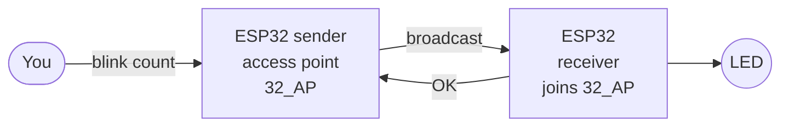
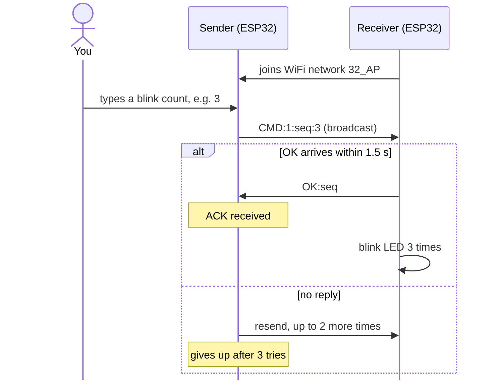

## 04 - Dual ESP32, Single LED

```mermaid
flowchart LR
    U(["You"]) -- "blink count" --> S["ESP32 sender<br/>access point<br/>32_AP"]
    S -- "broadcast" --> R["ESP32<br/>receiver<br/>joins 32_AP"]
    R -- "OK" --> S
    R --> L(("LED"))
```

```mermaid
%%{init: {"sequence": {"mirrorActors": false}}}%%
sequenceDiagram
    actor U as You
    participant S as Sender (ESP32)
    participant R as Receiver (ESP32)
    R->>S: joins WiFi network 32_AP
    U->>S: types a blink count, e.g. 3
    S->>R: CMD:1:seq:3 (broadcast)
    alt OK arrives within 1.5 s
        R->>S: OK:seq
        Note over S: ACK received
        R->>R: blink LED 3 times
    else no reply
        S->>R: resend, up to 2 more times
        Note over S: gives up after 3 tries
    end
```