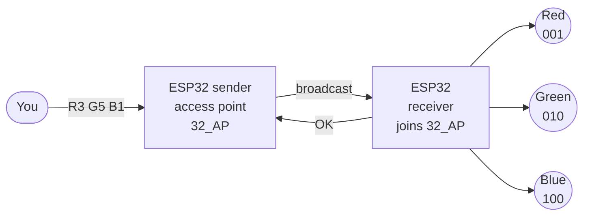
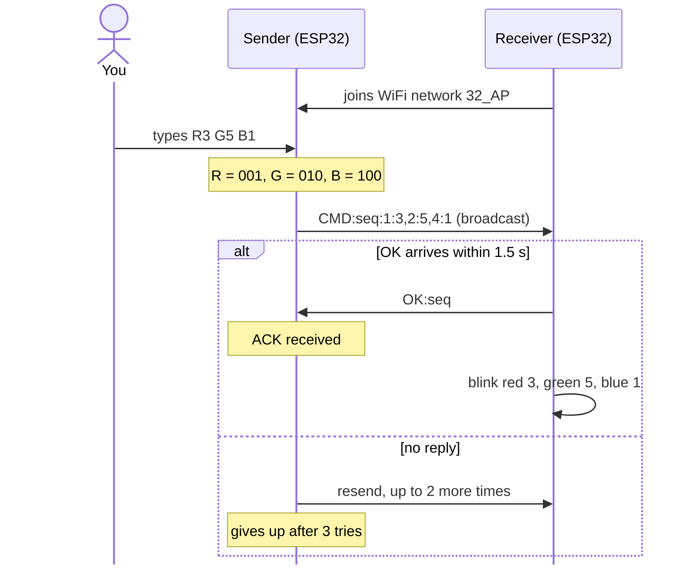

## 05 - Dual ESP32, Three LEDs

```mermaid
flowchart LR
    U(["You"]) -- "R3 G5 B1" --> S["ESP32 sender<br/>access point<br/>32_AP"]
    S -- "broadcast" --> R["ESP32<br/>receiver<br/>joins 32_AP"]
    R -- "OK" --> S
    R --> RED(("Red<br/>001"))
    R --> GRN(("Green<br/>010"))
    R --> BLU(("Blue<br/>100"))
```

```mermaid
%%{init: {"sequence": {"mirrorActors": false}}}%%
sequenceDiagram
    actor U as You
    participant S as Sender (ESP32)
    participant R as Receiver (ESP32)
    R->>S: joins WiFi network 32_AP
    U->>S: types R3 G5 B1
    Note over S: R = 001, G = 010, B = 100
    S->>R: CMD:seq:1:3,2:5,4:1 (broadcast)
    alt OK arrives within 1.5 s
        R->>S: OK:seq
        Note over S: ACK received
        R->>R: blink red 3, green 5, blue 1
    else no reply
        S->>R: resend, up to 2 more times
        Note over S: gives up after 3 tries
    end
```