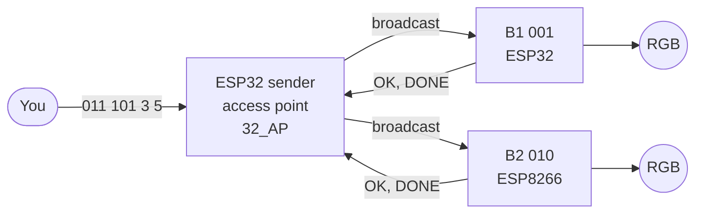
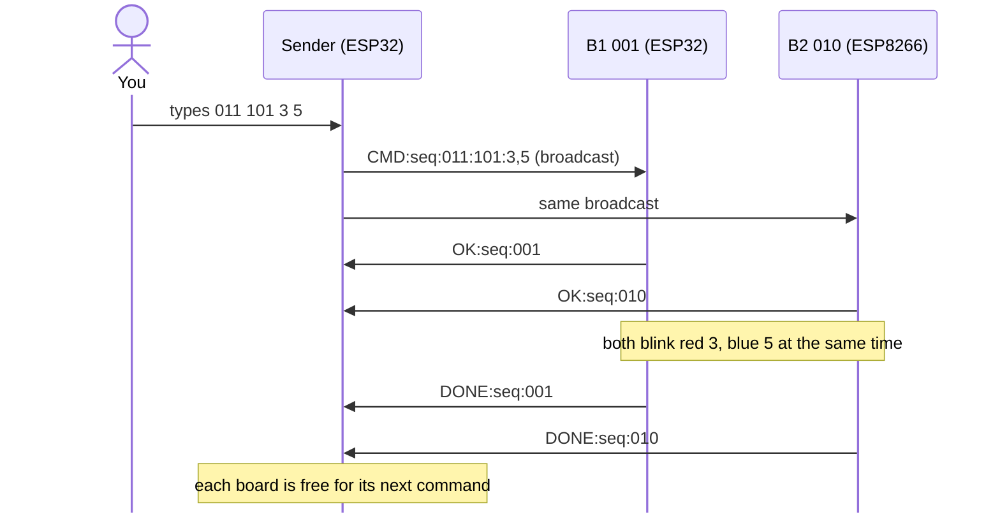

## 06 - Multi-Board

```mermaid
flowchart LR
    U(["You"]) -- "011 101 3 5" --> S["ESP32 sender<br/>access point<br/>32_AP"]
    S -- "broadcast" --> B1["B1 001<br/>ESP32"]
    S -- "broadcast" --> B2["B2 010<br/>ESP8266"]
    B1 -- "OK, DONE" --> S
    B2 -- "OK, DONE" --> S
    B1 --> L1(("RGB"))
    B2 --> L2(("RGB"))
```

```mermaid
%%{init: {"sequence": {"mirrorActors": false}}}%%
sequenceDiagram
    actor U as You
    participant S as Sender (ESP32)
    participant B1 as B1 001 (ESP32)
    participant B2 as B2 010 (ESP8266)
    U->>S: types 011 101 3 5
    S->>B1: CMD:seq:011:101:3,5 (broadcast)
    S->>B2: same broadcast
    B1->>S: OK:seq:001
    B2->>S: OK:seq:010
    Note over B1,B2: both blink red 3, blue 5 at the same time
    B1->>S: DONE:seq:001
    B2->>S: DONE:seq:010
    Note over S: each board is free for its next command
```
