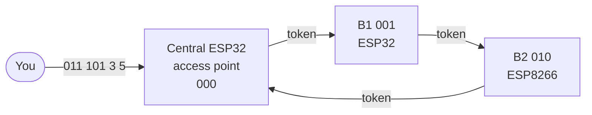
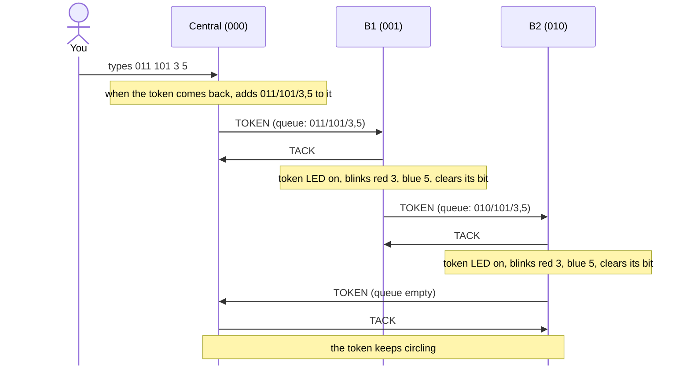

## 07 - Token Ring

```mermaid
flowchart LR
    U(["You"]) -- "011 101 3 5" --> C["Central ESP32<br/>access point<br/>000"]
    C -- "token" --> B1["B1 001<br/>ESP32"]
    B1 -- "token" --> B2["B2 010<br/>ESP8266"]
    B2 -- "token" --> C
```

```mermaid
%%{init: {"sequence": {"mirrorActors": false}}}%%
sequenceDiagram
    actor U as You
    participant C as Central (000)
    participant B1 as B1 (001)
    participant B2 as B2 (010)
    U->>C: types 011 101 3 5
    Note over C: when the token comes back, adds 011/101/3,5 to it
    C->>B1: TOKEN (queue: 011/101/3,5)
    B1->>C: TACK
    Note over B1: token LED on, blinks red 3, blue 5, clears its bit
    B1->>B2: TOKEN (queue: 010/101/3,5)
    B2->>B1: TACK
    Note over B2: token LED on, blinks red 3, blue 5, clears its bit
    B2->>C: TOKEN (queue empty)
    C->>B2: TACK
    Note over C,B2: the token keeps circling
```