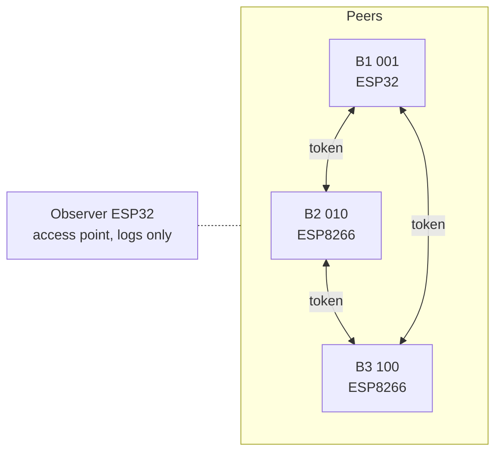
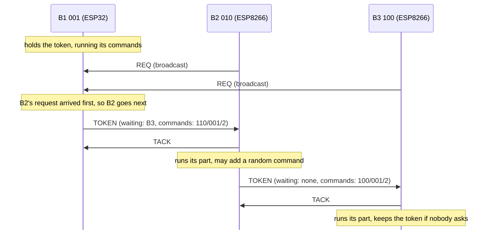

## 08 - Suzuki-Kasami

```mermaid
flowchart LR
    O["Observer ESP32<br/>access point, logs only"] -.- P
    subgraph P [Peers]
        B1["B1 001<br/>ESP32"] <-- "token" --> B2["B2 010<br/>ESP8266"]
        B2 <-- "token" --> B3["B3 100<br/>ESP8266"]
        B3 <-- "token" --> B1
    end
```

```mermaid
%%{init: {"sequence": {"mirrorActors": false}}}%%
sequenceDiagram
    participant B1 as B1 001 (ESP32)
    participant B2 as B2 010 (ESP8266)
    participant B3 as B3 100 (ESP8266)
    Note over B1: holds the token, running its commands
    B2->>B1: REQ (broadcast)
    B3->>B1: REQ (broadcast)
    Note over B1: B2's request arrived first, so B2 goes next
    B1->>B2: TOKEN (waiting: B3, commands: 110/001/2)
    B2->>B1: TACK
    Note over B2: runs its part, may add a random command
    B2->>B3: TOKEN (waiting: none, commands: 100/001/2)
    B3->>B2: TACK
    Note over B3: runs its part, keeps the token if nobody asks
```
