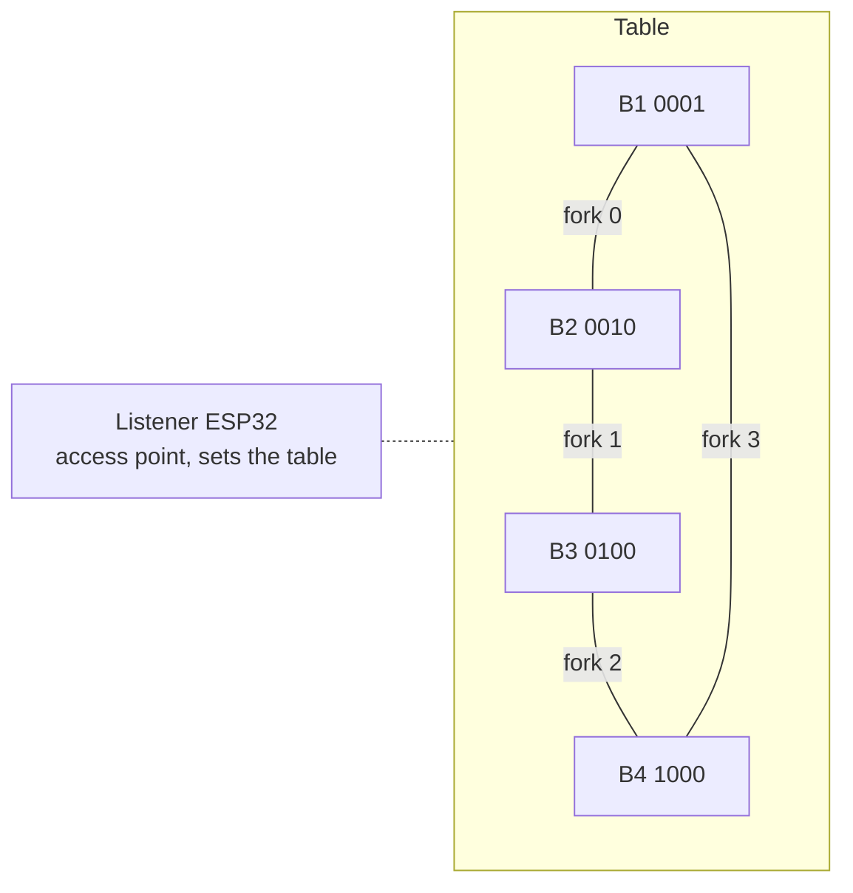
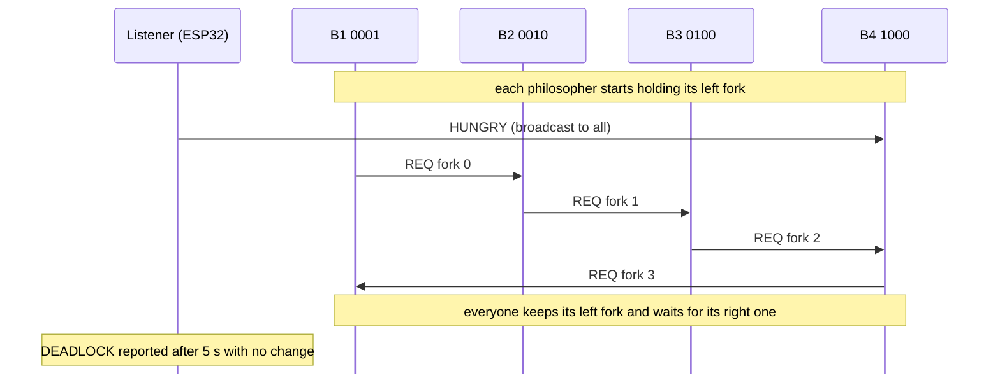

## 09 - Dining Philosophers: 01 - Classical

```mermaid
flowchart LR
    L["Listener ESP32<br/>access point, sets the table"] -.- T
    subgraph T [Table]
        B1["B1 0001"] --- |"fork 0"| B2["B2 0010"]
        B2 --- |"fork 1"| B3["B3 0100"]
        B3 --- |"fork 2"| B4["B4 1000"]
        B4 --- |"fork 3"| B1
    end
```

```mermaid
%%{init: {"sequence": {"mirrorActors": false}}}%%
sequenceDiagram
    participant L as Listener (ESP32)
    participant B1 as B1 0001
    participant B2 as B2 0010
    participant B3 as B3 0100
    participant B4 as B4 1000
    Note over B1,B4: each philosopher starts holding its left fork
    L->>B4: HUNGRY (broadcast to all)
    B1->>B2: REQ fork 0
    B2->>B3: REQ fork 1
    B3->>B4: REQ fork 2
    B4->>B1: REQ fork 3
    Note over B1,B4: everyone keeps its left fork and waits for its right one
    Note over L: DEADLOCK reported after 5 s with no change
```
