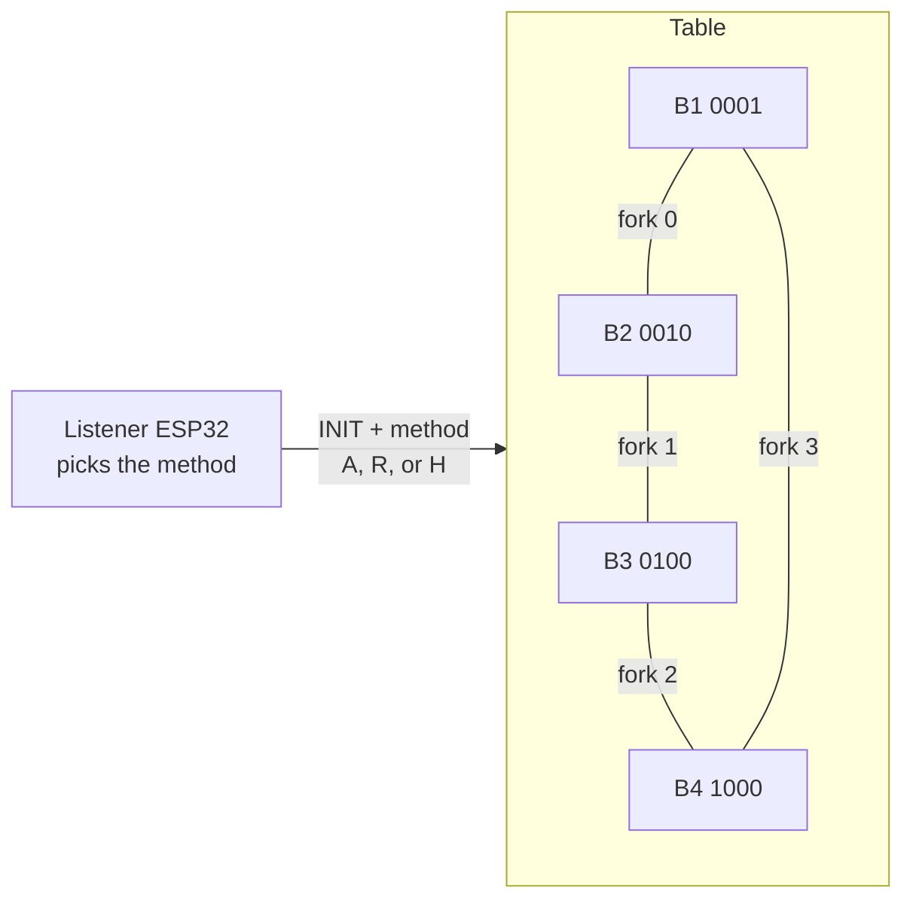
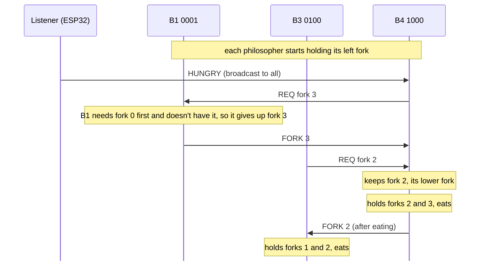
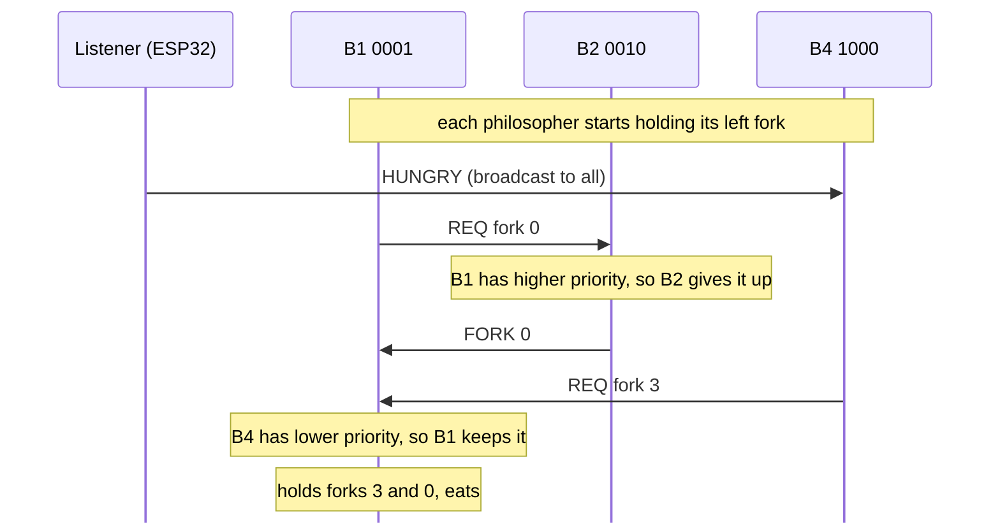
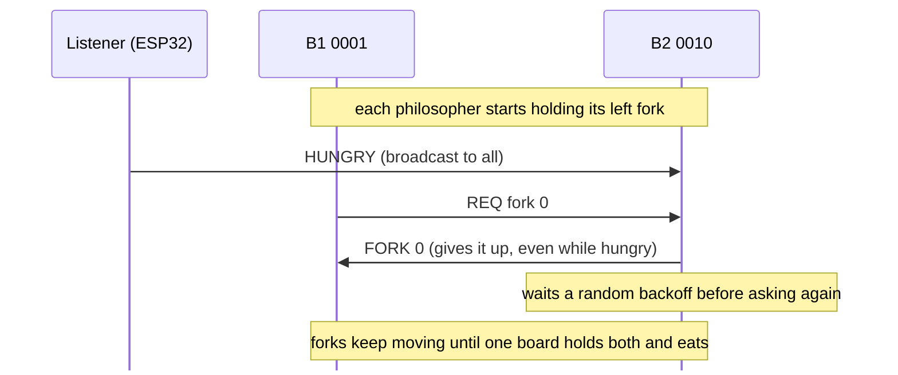

## 09 - Dining Philosophers: 02 - Prevention

```mermaid
flowchart LR
    L["Listener ESP32<br/>picks the method"] -- "INIT + method<br/>A, R, or H" --> T
    subgraph T [Table]
        B1["B1 0001"] --- |"fork 0"| B2["B2 0010"]
        B2 --- |"fork 1"| B3["B3 0100"]
        B3 --- |"fork 2"| B4["B4 1000"]
        B4 --- |"fork 3"| B1
    end
```

### Havender: lower-numbered fork first

```mermaid
%%{init: {"sequence": {"mirrorActors": false}}}%%
sequenceDiagram
    participant L as Listener (ESP32)
    participant B1 as B1 0001
    participant B3 as B3 0100
    participant B4 as B4 1000
    Note over B1,B4: each philosopher starts holding its left fork
    L->>B4: HUNGRY (broadcast to all)
    B4->>B1: REQ fork 3
    Note over B1: B1 needs fork 0 first and doesn't have it, so it gives up fork 3
    B1->>B4: FORK 3
    B3->>B4: REQ fork 2
    Note over B4: keeps fork 2, its lower fork
    Note over B4: holds forks 2 and 3, eats
    B4->>B3: FORK 2 (after eating)
    Note over B3: holds forks 1 and 2, eats
```

### Rosenkrantz: higher priority wins

```mermaid
%%{init: {"sequence": {"mirrorActors": false}}}%%
sequenceDiagram
    participant L as Listener (ESP32)
    participant B1 as B1 0001
    participant B2 as B2 0010
    participant B4 as B4 1000
    Note over B1,B4: each philosopher starts holding its left fork
    L->>B4: HUNGRY (broadcast to all)
    B1->>B2: REQ fork 0
    Note over B2: B1 has higher priority, so B2 gives it up
    B2->>B1: FORK 0
    B4->>B1: REQ fork 3
    Note over B1: B4 has lower priority, so B1 keeps it
    Note over B1: holds forks 3 and 0, eats
```

### All at once: hold nothing while waiting

```mermaid
%%{init: {"sequence": {"mirrorActors": false}}}%%
sequenceDiagram
    participant L as Listener (ESP32)
    participant B1 as B1 0001
    participant B2 as B2 0010
    Note over B1,B2: each philosopher starts holding its left fork
    L->>B2: HUNGRY (broadcast to all)
    B1->>B2: REQ fork 0
    B2->>B1: FORK 0 (gives it up, even while hungry)
    Note over B2: waits a random backoff before asking again
    Note over B1,B2: forks keep moving until one board holds both and eats
```